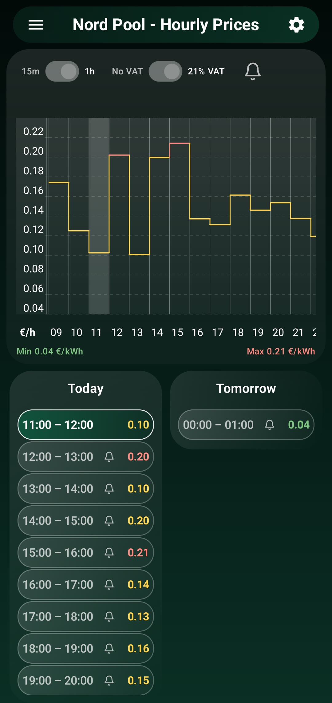
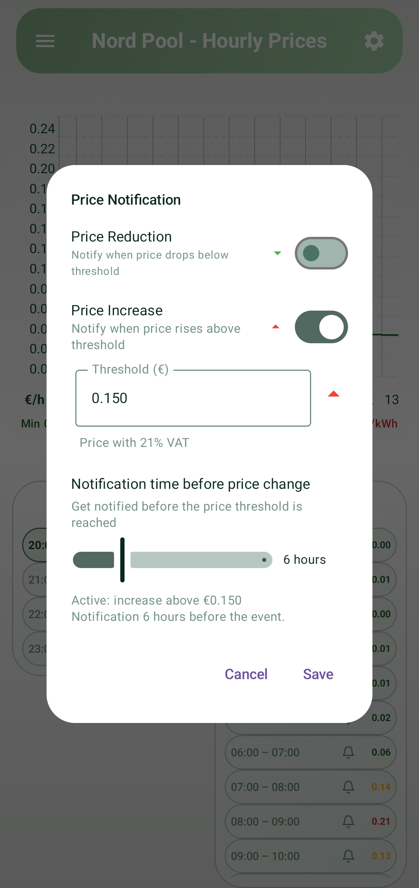
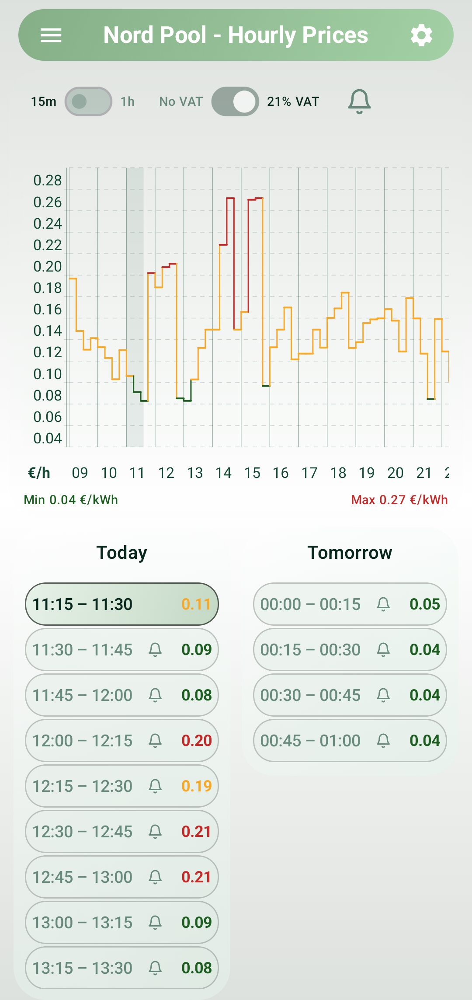

# Nord Pool — Hourly Prices (Latvia, Estonia, Lithuania)

A simple app to view and monitor Nord Pool electricity prices. Use it to spot cheap hours, set price alerts, and glance at price trends for today and tomorrow.

## 🧭 Features

- Clean two-column price list (Today & Tomorrow) with easy-to-scan hour rows
- Interactive 24-hour price chart with current-hour highlight
- VAT toggle (No VAT / 21% VAT) to preview final prices including tax
- Resolution toggle (15m / 1h) for finer or coarser data
- Price threshold notifications (reduction / increase) with configurable lead time

## Quick overview

- Clean two-column price list (Today & Tomorrow) with easy-to-scan hour rows.
- Interactive price chart showing the 24-hour trend.
- Toggles for VAT and data resolution (15 minutes or 1 hour) for quick comparisons.
- Set price alerts (reduction or increase) and receive notifications when thresholds are reached.

## Main controls

- 15m / 1h — Switch between 15-minute and 1-hour data resolution. Use 15m for finer detail (more rows), 1h for a simpler view.
- No VAT / 21% VAT — Toggle to show prices without tax or including 21% VAT. This changes the displayed values so you can plan with tax included.
- Bell icon — Tap any row's bell to configure notifications for that hour.

## How to use notifications

1. Tap the bell icon on any hour in the list (or the top bell) to open the notification dialog.
2. Choose "Price Reduction" to be notified when the price drops below a threshold, or "Price Increase" for when it rises above a threshold.
3. Enter the threshold price and set how far in advance you'd like the notification.
4. Save. The app schedules the alert and will notify you even if the app is in the background.

## Tips

- If you plan to run appliances at the cheapest times, enable VAT to see the final price you'll pay.
- Use 15m resolution when you want to capture shorter windows (useful for battery charging or flexible loads).
- Use the chart to compare price patterns visually before setting alerts.

## Privacy & permissions

- The app requests only essential permissions for notifications and installs (if installing an APK). It does not upload personal data to third-party servers.
- Notification permission: required to deliver scheduled alerts. Please allow it for full functionality.

## Troubleshooting

- No prices shown: check your network connection and tap refresh (pull down on the chart).
- Notifications not arriving: ensure notification permission is granted and the device's battery optimizations allow background alarms.

## Screenshots

<table border="0" style="width:100%; border-collapse:collapse; border:0;">
	<tr>
		<td style="width:50%; text-align:center; padding:8px; vertical-align:top;">
			
			
Light theme

		</td>
		<td style="width:50%; text-align:center; padding:8px; vertical-align:top;">
			
			
Dark theme

		</td>
	</tr>
</table>
